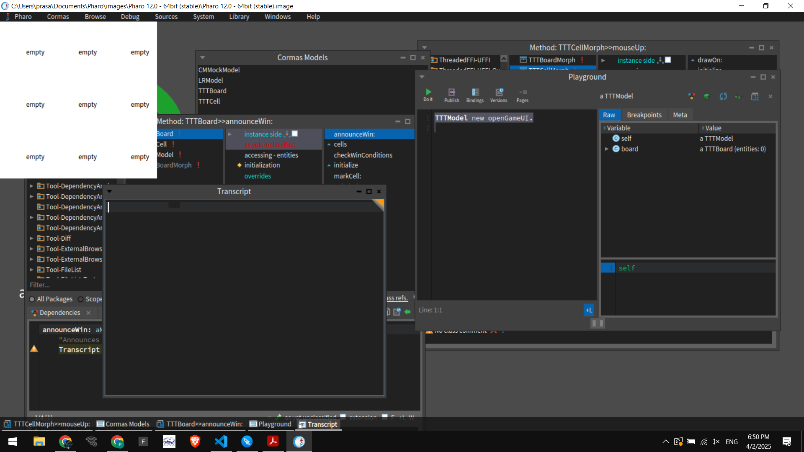
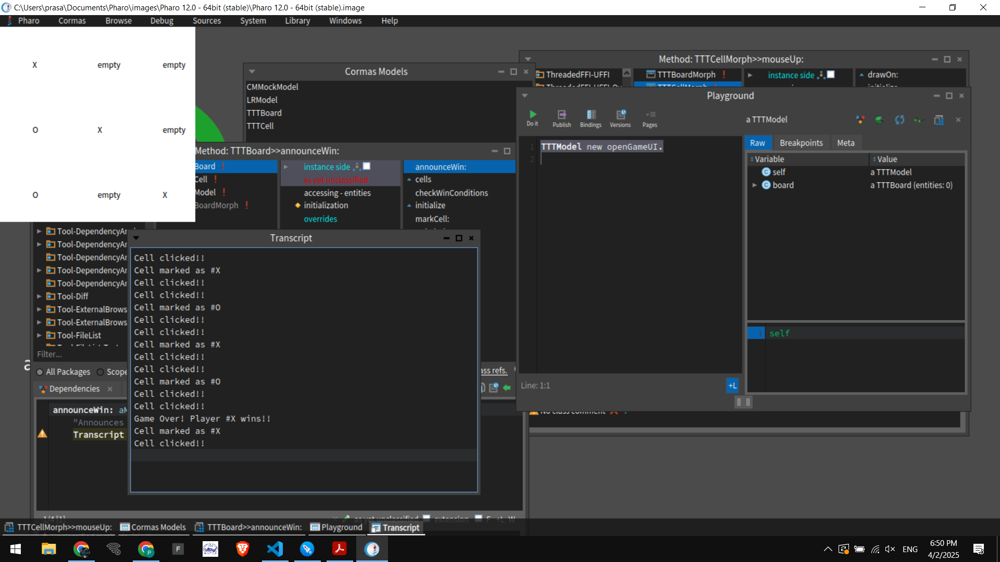

# Tic-Tac-Toe Game in Pharo (Cormas)

## 📌 Project Overview
This is a simple **Tic-Tac-Toe** game built in **Pharo 12** with **Cormas**. The game follows the classic 3x3 grid format, allowing two players to play alternately. The project includes:

- **Model:** Defines the game logic and board structure.
- **UI (Morphic):** Displays the board and allows player interaction.
- **Win Condition Checking:** Automatically detects a win or draw.

## 🛠️ Setup Instructions

### **1️⃣ Install Pharo & Load Cormas**
1. Download **Pharo 12** from [Pharo Official Site](https://pharo.org/)
2. Install **Cormas** by executing:
   ```smalltalk
   Metacello new
       baseline: 'Cormas';
       repository: 'github://cormas/cormas';
       load.
   ```

### **2️⃣ Clone the Repository**
```sh
 git clone https://github.com/your-username/TicTacToe-Pharo.git
 cd TicTacToe-Pharo
```

### **3️⃣ Load the Code in Pharo**
1. Open Pharo.
2. Open the **Iceberg** browser (`World Menu > Tools > Iceberg`).
3. Add a new repository and point it to the cloned project directory.
4. Load all the packages.

## 🎮 Gameplay Instructions
1. Run the following in the **Playground**:
   ```smalltalk
   TTTModel new openGameUI.
   ```
2. Click on the empty cells to mark them as `X` or `O`.
3. The game will detect a **win** or **draw** and display a message.
4. Restart the game manually if needed.

## 📸 Screenshots
### **1️⃣ Game Start**


### **2️⃣ Player Moves**


### **3️⃣ Win Screen**


## 📂 Project Structure
```
TicTacToeGame-Model/
│   ├── TTTModel.st       # Main model class
│   ├── TTTBoard.st       # Tic Tac Toe board logic
│   ├── TTTCell.st        # Represents a single cell
│
TicTacToeGame-UI/
│   ├── TTTBoardMorph.st  # UI for the board
│   ├── TTTCellMorph.st   # UI for individual cells
│
Documentation/
│   ├── README.md         # Project documentation
│   ├── screenshots/      # Images for reference
```

## 🤝 Contributing
Feel free to submit **issues** or **pull requests** if you want to enhance the game!


